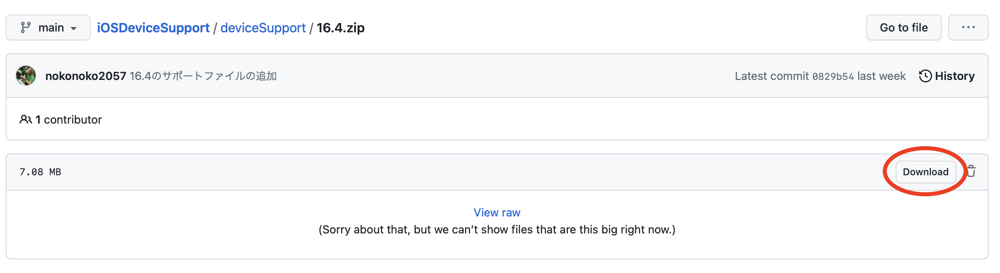

# iOSDeviceSupport

## 使い方
1. iPhoneのバージョンを確認する
    - `設定　→ 一般 → 情報 → iOSバージョン`
  
2. 対応するDeviceSupportファイルをダウンロードする
    - deviceSupportをクリック
    - [欲しいバージョン].zipをクリック
    - 右上のDownloadボタンを押してダウンロード
    - 
  
3. ダウンロードしたファイルを移動する
    - ダウンロードした.zipファイルをダブルクリックして展開する
    - 展開したファイルをコピー (command + C)
    - Finderを開き、左のタブからアプリケーションを選択
    - Xcodeを見つけて右クリック → パッケージの内容を表示
    - `Contents/Developer/Platforms/iPhoneOS.platform/DeviceSupport/`まで移動
    - `DeviceSupport/`まで移動したら、貼り付ける(command + V)
 
4. Xcodeを再起動する
    - DockのXcodeを右クリック → 終了
    - プロジェクトを開く
